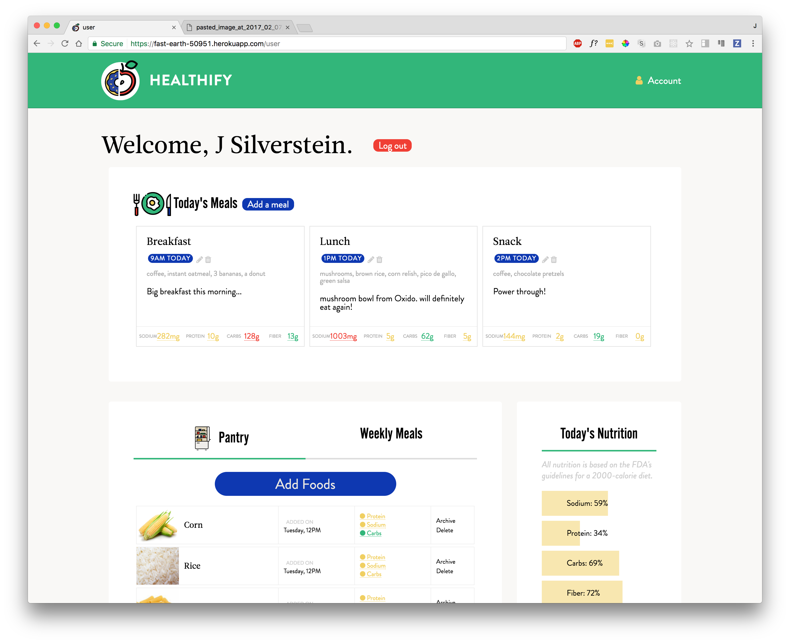
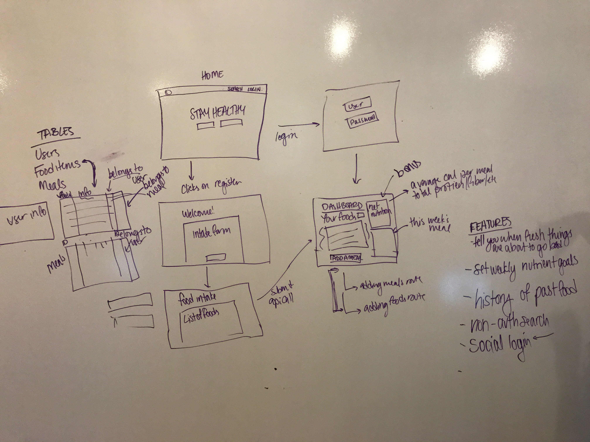

# HEALTHIFY!





### What is Healthify? (Mind-Full Eating)
#####
Healthify is a simple web application built for fitness casuals who need an easy way of tracking the foods that they are eating. We believe that by using natural language to add foods & meals and creating an intuitive interface, we will achieve a higher rate of long-term engagement & more useful/actionable output for the user. We came up with this idea because many food tracking apps are too labor-intensive and focus too much on metrics.


### Healthify vs. Competitors
|                                 | Up | Nutritionix | My Fitness Pal | Healthify |
|---------------------------------|----|-------------|----------------|-----------|
| Weight Loss Metrics             | Y  | Y           | Y              | N*        |
| User Dashboard                  | Y  | Y           | Y              | Y         |
| History of Past Foods           | Y  | Y           | Y              | Y         |
| Accessible Content Before Login | N  | N           | N              | Y         |

*Our app intentionally doesn't track weight in order to make the experience less focused on performance and appearance for our users.

#### API CALL FROM [NUTRITIONIX](https://developer.nutritionix.com/)

```Javascript
	function getFoodInfo(req,res,next) {
  		apiCall.nutriAXIOS.post('/', {
    		query: `${req.body.foodName}`,
    		timezone: 'US/Eastern'
 		}).then((theResult) => {
   			res.locals.foodData = theResult.data.foods;
   			return next();
  		}).catch((err) => console.log(err));
	}
```

### Wireframe

Additional wireframes can be found [here](https://www.dropbox.com/sh/je4oj3ubcu4theh/AAC_HsVNkY0JQveHIdEAoRMaa?dl=0)

### Technologies Used:
- Node: Express
- JavaScript: EJS, [Hopscotch](https://github.com/linkedin/hopscotch)
- CSS: SASS, Materialize, Flexbox
- Postgres
- Moment
- Axios
- D3!


### Additional Sources:

[Our ZenHub Board](https://github.com/jlr7245/healthify/projects/1?fullscreen=true)
[NUTRITIONIX API](https://developer.nutritionix.com/)
[ICONS from The Noun Project:](https://thenounproject.com/)
- Daily Meals icon by Anbileru Adaleru,
- Iced Donut by Imogen Oh,
- Apple Half by Imogen,
- Refrigerator by Wojciech Zasina
- Calender by Luciano Vizza

### Directions for Future Growth:
- Ability for user to edit time of a meal
- Weekly & monthly nutritional aggregate tracking
- Ability for user to build a meal from foods in pantry (requires serving size logic that we didn't have time to get to) 


